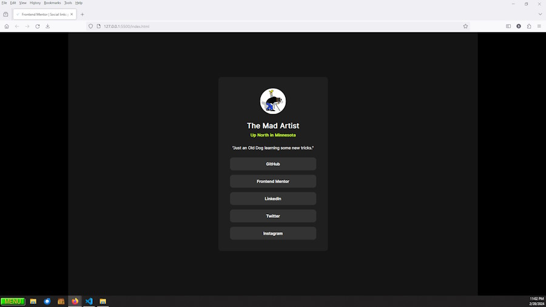

# Frontend Mentor - Social links profile solution

This is a solution to the [Social links profile challenge on Frontend Mentor](https://www.frontendmentor.io/challenges/social-links-profile-UG32l9m6dQ). Frontend Mentor challenges help you improve your coding skills by building realistic projects. 

## Table of contents

- [Overview](#overview)
  - [The challenge](#the-challenge)
  - [Screenshot](#screenshot)
  - [Links](#links)
- [My process](#my-process)
  - [Built with](#built-with)
  - [What I learned](#what-i-learned)
  - [Continued development](#continued-development)
  - [Useful resources](#useful-resources)
- [Author](#author)
- [Acknowledgments](#acknowledgments)

## Overview

### Screenshot

### Links

- Solution URL: [Social Links Profile](https://madartistphoto.github.io/social-links-profile-main/)

## My process

### Built with

- Visual Studio Code - using HTML5 & CSS3
- Mobile-first workflow
- ZonerX (for viewing the supplied images)
- Paint.net (for creating the Screenshot image and custom cursor)
- Greenfish Icon Editor (for creating custom cursor)
- GitHub Pages
- GitHub (still very un-intuitive, but I'm learning)

### What I learned

- This was a pretty simple design. Yet it was a good one to practice the basics.

- This project shows a black hand for the pointer in the 'active' design image. That was a challenge to replicate.

- First time using .gitignore. I figure I don't need to push un-needed files (ie: style-guide, README-template, etc.) to GitHub.

- Learning more about GitHub everytime I use it.

### Continued development

- DO NOT START CODING ON THE COMPUTER. Either print it out and makes notes on the printed page ordraw it out and make notes there. Then start writing the code by hand.

- I need to finish the last few CSS lessons on W3Schools. Then I can start learning JavaScript.

- Practice makes perfect. While my coding is nowhere near perfect I have learned over the years that the more time spent doing something like this that I enjoy results in faster learning and greater retention. So I am trying to spend at least one or two hours a day writing code, checking out GitHub, perusing Frontend Mentor, or doing something related to coding.

## Useful Resources

- W3School - Yeah, many people give them grief for being simplistic and out-dated. But starting out with Frontend Mentor doesn't require cutting edge coding. They are a good source for the basics.

## Author

- Website - [My Frontend Mentor Landing Page](https://madartistphoto.github.io/FM-Landing-Page/)
- Frontend Mentor - [John](https://www.frontendmentor.io/profile/MadArtistPhoto)

## Acknowledgments

Just a shout out to all other creators on Frontend Mentor. It is wonderful learning experience to view other solutions and see how other Coders create the same thing.
